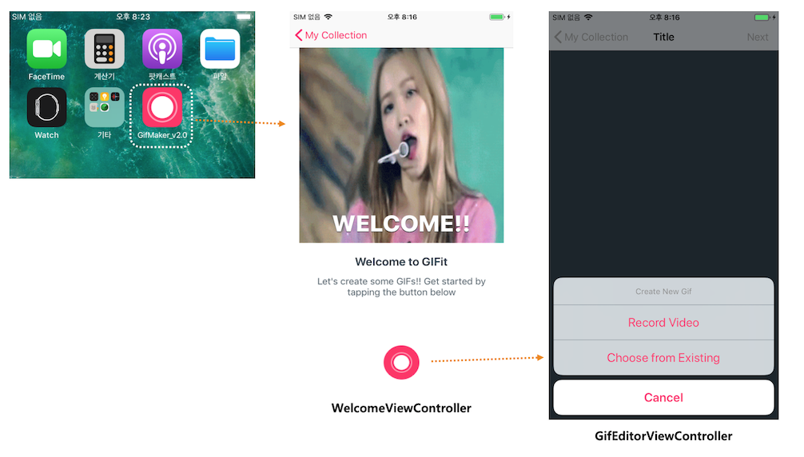
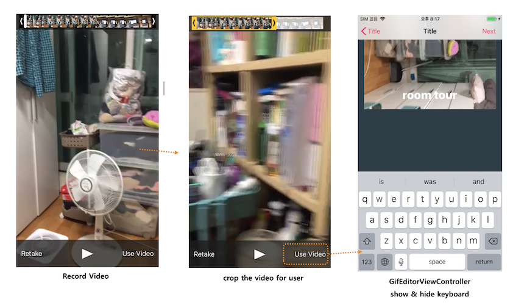
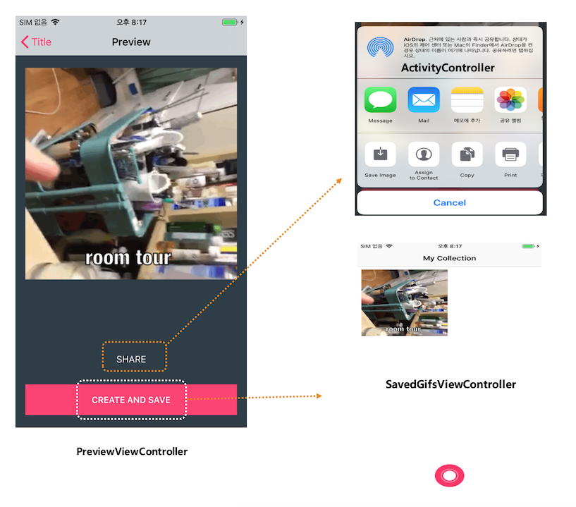
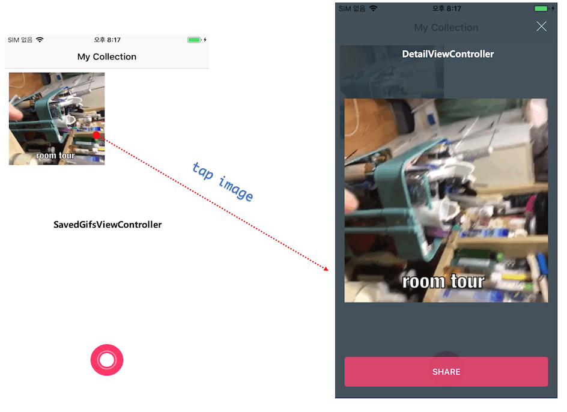

# GifMaker v2.0
video 파일을 GIF파일로 변환하는 기능, 편집하기 기능도 추가
### Index
- [기능](#기능)
- [설계 및 구현](#설계-및-구현)
- [trouble shooting](#trouble-shooting)
- [학습한 내용](#관련-학습-내용)

## 할일  
- [GIF 파일 저장하기](#GIF-파일-저장하기)  (완료)
- [저장된 GIF파일 Collection View 보기](#저장된-GIF파일-Collection-View-보기) (완료)
- [선택된 GIF파일 세부사항 보기](#선택된-GIF파일-세부사항-보기) (완료)
- [저장된 GIF파일 유지하기](#저장된-GIF파일-유지하기)
- [터치 종료](#터치-종료)

## 화면 구성

